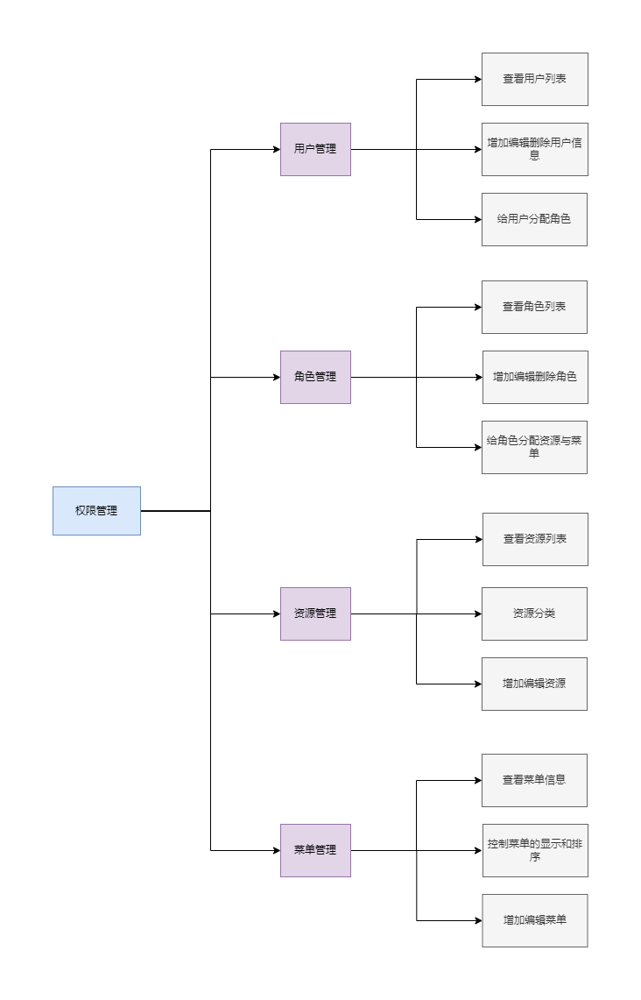

# acs权限控制系统


## **技术选型**

- Spring Boot 2.3.0
- MyBatis-Plus
- SpringSecurity
- jjwt
- Redis
- MySQL


## **项目结构**

```
- common 公共模块
	-- api 响应数据封装
	-- config 基础配置
	-- properties 系统通用属性
	-- exception 异常处理
	-- service 系统通用服务
	-- utils 系统通用工具
- config 系统配置模块
- generator 代码生成模块
- security 安全模块
	-- authentication security自定义组件
	-- config security配置
	-- service 权限服务
- sys 系统业务模块
- AcsApplication 系统启动类
```


## **系统功能**




## **权限设计思路**


每个用户可以被分配多个角色，每个角色拥有着对应的资源与菜单，用户与角色之间，角色与资源之间，角色与菜单之间都是多对多的对应关系，用户通过分配角色，从而拥有这个角色被分配的资源与菜单

本系统基于SpringSecurity的认证鉴权功能实现了基于访问路径的动态权限控制，用户登录成功后，系统将会获得此用户拥有的权限信息存入到security上下文中。当用户请求受保护的资源时，自定义的鉴权拦截器会拦截请求，进行权限的判定，如果用户拥有访问此路径的权限则放行，否则拒绝用户的请求

由于本项目是前后端分离，所以采用基于`JWT Token`和`Spring Security`实现权限控制

`Spring Security`框架主要用来**认证和授权**

**认证流程**

1. 通过前端发出的请求携带着的身份信息创建一个未认证UsernamePasswordAuthenticationToken对象（Authentication的实现类）
2. 查数据库比较身份信息
   1. 密码正确即认证成功，生成token（以后的请求都要带上这个token），将认证成功的Authentication对象存入Security上下文中
   2. 密码错误即认证失败，抛出相应异常

认证成功之后，拿到token进行接下来的请求，需要解析token来判断用户的身份是否有效，是否拥有权限，所以需要写一个过滤器来做JWT的校验

**JWT校验器的校验流程：**

1. 拿到Authorization请求头对应的token信息

2. 通过解析token，拿到身份信息进行判断(身份信息是否存在，与我们之前登陆保存在缓存中的身份信息是否一致，token是否过期等)

3. 封装UsernamePasswordAuthenticationToken对象，把它放在上下文对象中，以便于后面的过滤器进行鉴权

**鉴权流程**

​	一个请求完成了认证，且没有抛出异常之后就会到达FilterSecurityInterceptor所负责的鉴权部分

1. 创建实现AbstractSecurityInterceptor接口的过滤器，拦截用户的请求，调用AccessDecisionManager中的decide方法进行鉴权

2. 创建实现FilterInvocationSecurityMetadataSource接口的类，获取路径（key）与权限（value）的map，与请求路径匹配，将匹配成功的value返回给AccessDecisionManager鉴权；

			3. 创建实现AccessDecisionManager接口动态权限决策器，进行权限判定，即authentication对象中拥有的权限是否包含此请求路径所需要的权限；

